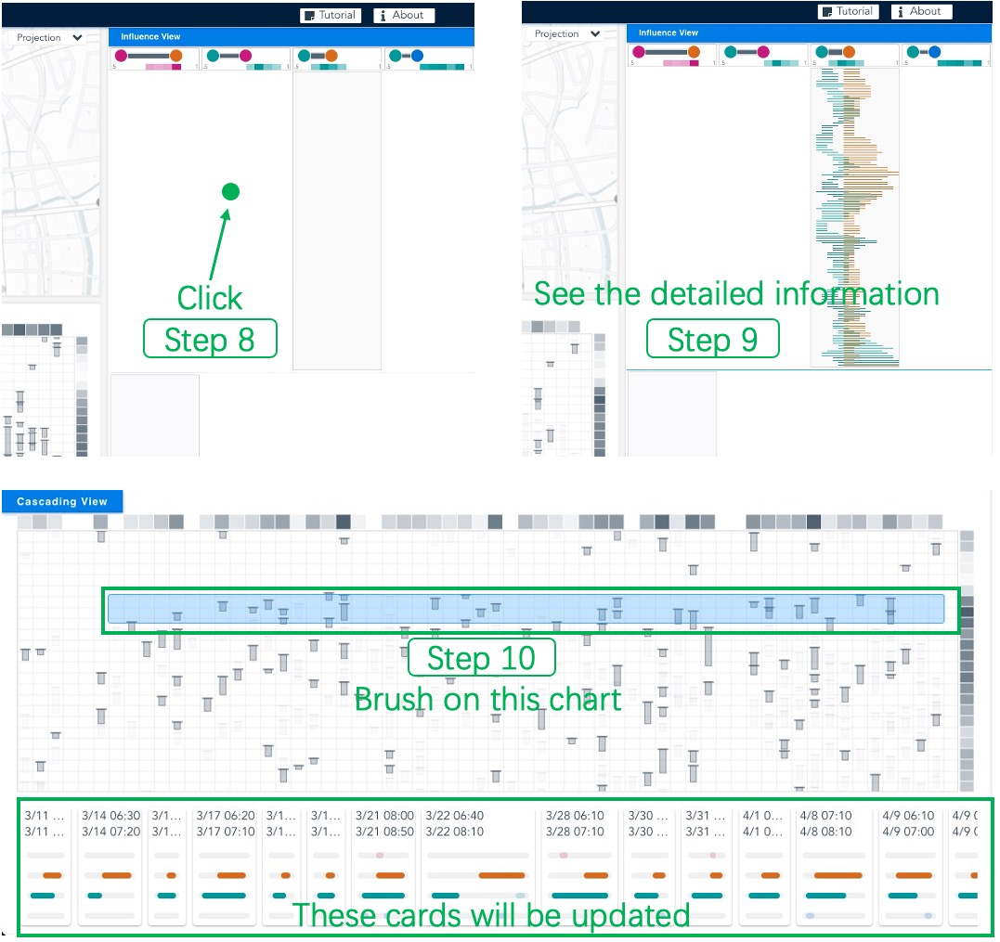

# Visual Cascade Analytics of Large-scale Spatiotemporal Data

[Paper Link](https://zjuidg.org/source/projects/VisCas/VisCas.pdf)

Abstract: Many spatiotemporal events can be viewed as contagions. These events implicitly propagate across space and time by following cascading patterns, expanding their influence, and generating event cascades that involve multiple locations. Analyzing such cascading processes presents valuable implications in various urban applications, such as traffic planning and pollution diagnostics. Motivated by the limited capability of the existing approaches in mining and interpreting cascading patterns, we propose a visual analytics system called VisCas. VisCas combines an inference model with interactive visualizations and empowers analysts to infer and interpret the latent cascading patterns in the spatiotemporal context. To develop VisCas, we address three major challenges, 1) generalized pattern inference, 2) implicit influence visualization, and 3) multifaceted cascade analysis. For the first challenge, we adapt the state-of-the-art cascading network inference technique to general urban scenarios, where cascading patterns can be reliably inferred from large-scale spatiotemporal data. For the second and third challenges, we assemble a set of effective visualizations to support location navigation, influence inspection, and cascading exploration, and facilitate the in-depth cascade analysis. We design a novel influence view based on a three-fold optimization strategy for analyzing the implicit influences of the inferred patterns. We demonstrate the capability and effectiveness of VisCas with two case studies conducted on real-world traffic congestion and air pollution datasets with domain experts.


## Installation

### Prerequisites
* [Docker](https://docs.docker.com/get-docker/) 20.10
* [Docker Compose](https://docs.docker.com/compose/cli-command/#installing-compose-v2) v2
* Google Chrome

### Build & Run
``sudo`` can be omitted if the current user has sufficient privilege to execute docker commands:

```shell script
$ sudo docker compose up
```

VisCas can now be accessed via http://localhost:8080 with Chrome.

## Data description

The datasets directly used by the system are placed under /backend/output/congestion2Data (traffic congestion dataset) and /backend/output/airData (air pollution event dataset).

The traffic congestion dataset is extracted from taxi trajectories that provided by local authorities.
After extraction, the dataset comprises the congestion event series of every road segments.
Due to the sensitivity of the data, onl the **samples** related to the case are released in this repository.

The air pollution event dataset can be collected and derived from air quality websites, for example, [New York Air Pollution](https://aqicn.org/city/usa/newyork/).


## Replicability

We provide a [DEMO Video](https://www.youtube.com/watch?v=IVSf0BNRC_c&t=3s) to guide the reproduction of the cases in [our paper](https://zjuidg.org/source/projects/VisCas/VisCas.pdf).
The video content is divided into three parts.
The first part introduces the system.
The second and third parts introduce two cases, respectively.
<!-- Besides, we have also provided [a step-by-step tutorial](replicate/readme.md). -->
After the frontend and backend run, users can follow the video and the key steps below to reproduce the two cases.

### Reproduce the first case

* Step 1: Users load the congestion dataset using a drop-down menu.
* Step 2: Users hover over the \``Porjection`` button to trigger the scatterplot.
* Step 3: Users use the lasso tool to select the most outlier cluster.
* Step 4: The filtered locations are shown on the map.

<p align="center">

</p>

<!--  -->

* Step 5: Users use the polygon selection to select the ten locations on the map.
* Step 6: Users click the \``infer`` button after drawing the polygon.
* Step 7: The cascading pattern is shown.

<p align="center">

</p>
<!--  -->

* Step 8: Users click the green point we annotated.
* Step 9: The cell will be unfolded to show detailed information.
* Step 10: Users brush on the cascading view by drawing a rectangle. The cascading cards below will be updated according to the brush interaction.

<p align="center">

</p>
<!--  -->

* Step 11: Users cancel the brush of Step 10 by clicking on the cascading view.
* Step 12: Users click the green annotated points again following Step 8.
* Step 13: Users click the first column header as indicated by the green point we annotated.

<p align="center">

</p>
<!--  -->

* Step 14: The cascading view has been updated to show the new temporal distribution.

<p align="center">

</p>
<!--  -->

### Reproduce the second case

* Step 1: Users load the air pollution dataset using a drop-down menu.
* Step 2: Users zoom in to Hangzhou.

<p align="center">

</p>
<!--  -->

* Step 3: Users use the polygon selection to select the ten locations on the map.
* Step 4: Users click the \``infer`` button after drawing the polygon.
* Step 5: The cascading pattern is shown.

<p align="center">

</p>
<!--  -->

* Step 6: Users click the \``check`` button.
* Step 7: The details are shown.

<p align="center">

</p>
<!--  -->

* Step 8: Users click the \``check`` button again to close the details.
* Step 9: Users click the third and fourth column headers.
* Step 10: Users browse the cascading cards.

<p align="center">

</p>
<!--  -->

* Step 11: Users click the third and fourth column headers again and go back.
* Step 12: Users can see the temporal distribution of all cascades.

<p align="center">

</p>
<!--  -->

There is an interaction issue in the system.
Panning the map cannot load the visual elements that weren't previously in the viewport.
These visual element needs to be re-rendered by zooming in or out.

## Note
We use leaflet.js and mapbox for map services. which is for academic purposes **only** and does **not** indicate any political standpoints.

## Citation
If you use this code for your research, please consider citing:
```
@article{deng2021viscas,
  title={Visual Cascade Analytics of Large-scale Spatiotemporal Data},
  author={Deng, Zikun and Weng, Di and Liang, Yuxuan and Bao, Jie and Zheng, Yu and Schreck, Tobias and Xu, Mingliang and Wu, Yingcai},
  journal={IEEE Transactions on Visualization and Computer Graphics},
  year={2022},
}
```
