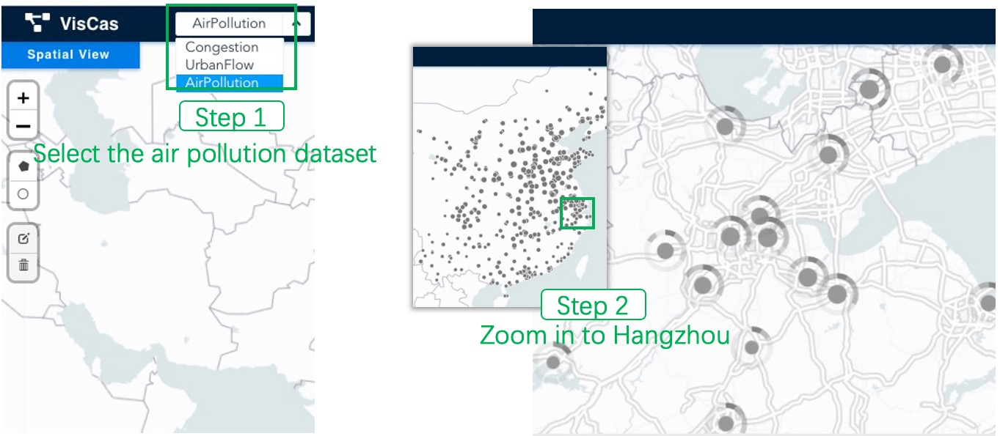
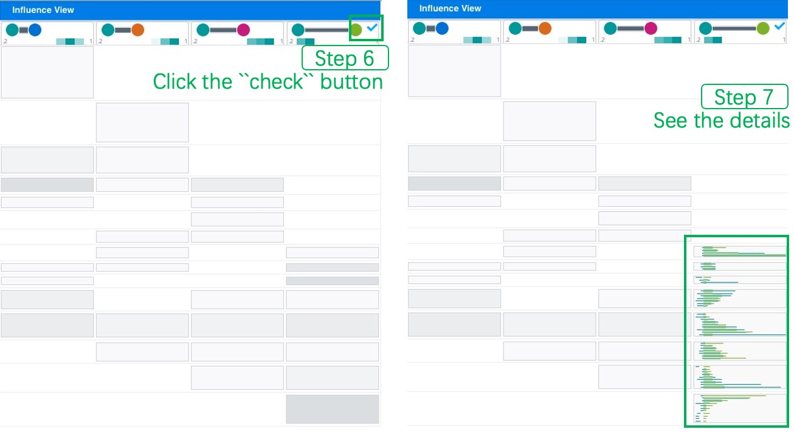

# Step-by-step tutorial for reproduction

## Reproduce the first case

* Step 1: Users load the congestion dataset using a drop-down menu.
* Step 2: Users hover over the \``Porjection`` button to trigger the scatterplot.
* Step 3: Users use the lasso tool to select the most outlier cluster.
* Step 4: The filtered locations are shown on the map.

<!--  -->

* Step 5: Users use the polygon selection to select the ten locations on the map.
* Step 6: Users click the \``infer`` button after drawing the polygon.
* Step 7: The cascading pattern is shown.

<!--  -->

* Step 8: Users click the green point we annotated.
* Step 9: The cell will be unfolded to show detailed information.
* Step 10: Users brush on the cascading view by drawing a rectangle. The cascading cards below will be updated according to the brush interaction.

<!--  -->

* Step 11: Users cancel the brush of Step 10 by clicking on the cascading view.
* Step 12: Users click the green annotated points again following Step 8.
* Step 13: Users click the first column header as indicated by the green point we annotated.

<!--  -->

* Step 14: The cascading view has been updated to show the new temporal distribution.

<!--  -->

## Reproduce the second case

* Step 1: Users load the air pollution dataset using a drop-down menu.
* Step 2: Users zoom in to Hangzhou.

<!--  -->

* Step 3: Users use the polygon selection to select the ten locations on the map.
* Step 4: Users click the \``infer`` button after drawing the polygon.
* Step 5: The cascading pattern is shown.

<!--  -->

* Step 6: Users click the \``check`` button.
* Step 7: The details are shown.

<!--  -->

* Step 8: Users click the \``check`` button again to close the details.
* Step 9: Users click the third and fourth column headers.
* Step 10: Users browse the cascading cards.

<!--  -->

* Step 11: Users click the third and fourth column headers again and go back.
* Step 12: Users can see the temporal distribution of all cascades.

<!--  -->